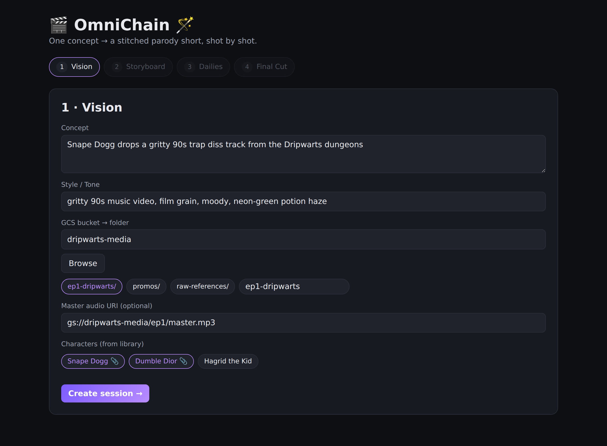
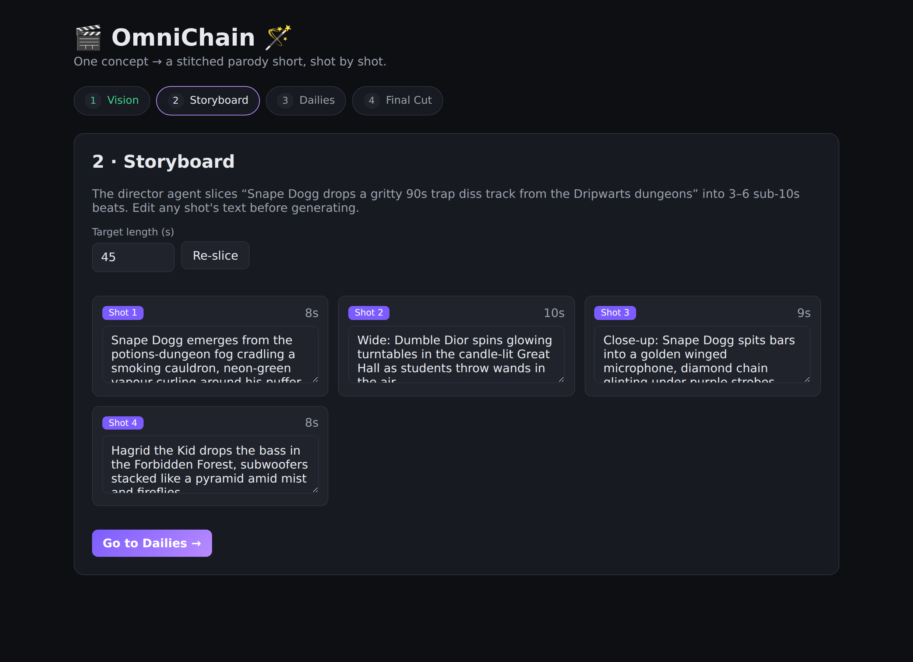
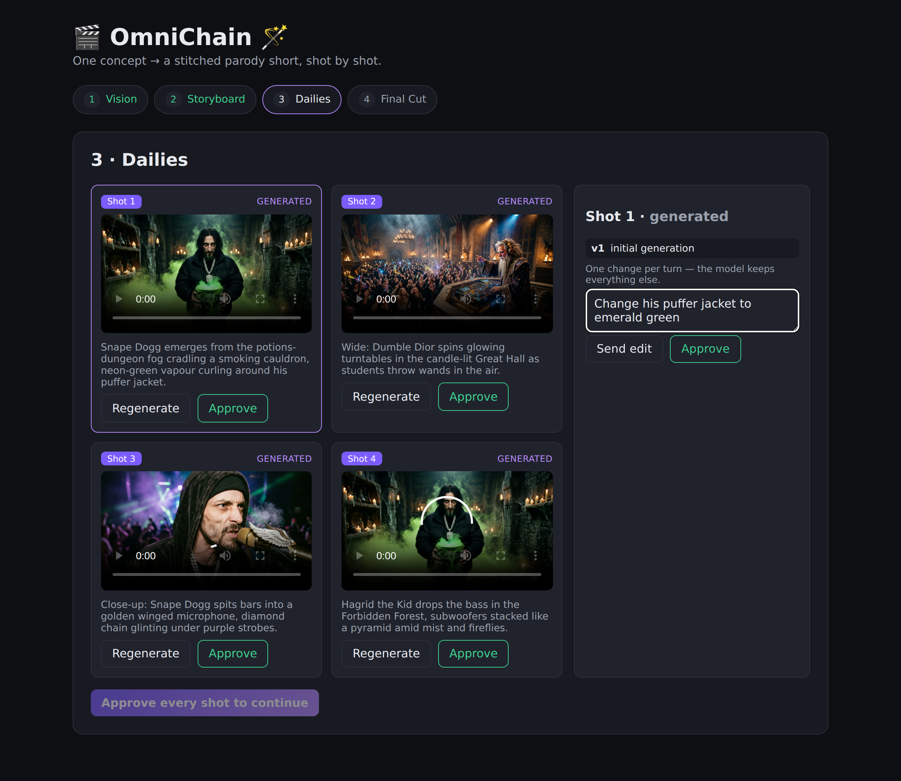
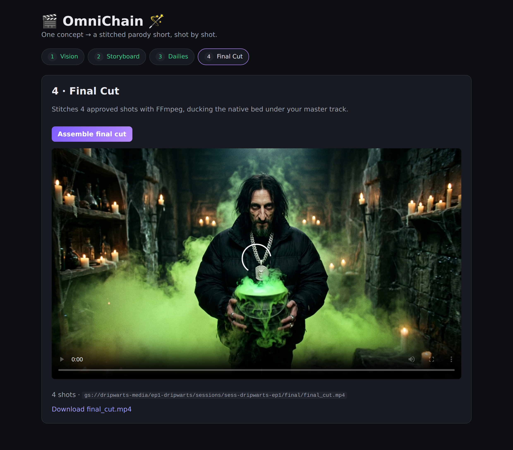
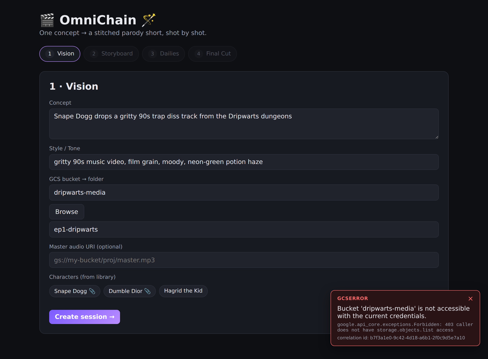
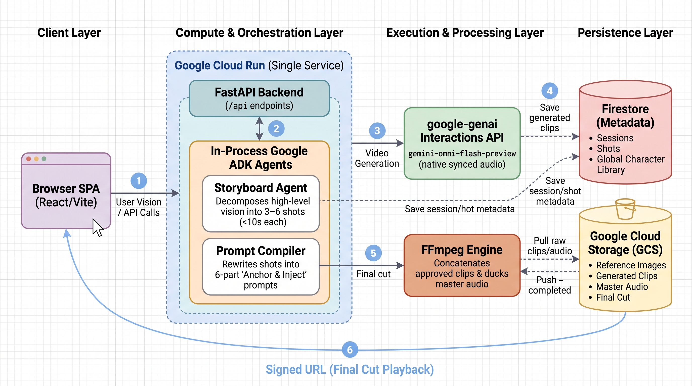
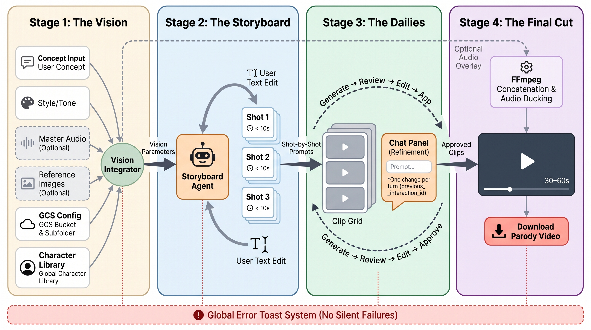

<div align="center">

[](imgs/omnichain_banner.png)

# 🎬 OmniChain 🪄

[](https://www.python.org/)
[](https://docs.astral.sh/uv/)
[](https://docs.astral.sh/ruff/)
[](https://github.com/astral-sh/ty)
[](https://adk.dev/)
[](https://docs.cloud.google.com/gemini-enterprise-agent-platform)
[](https://ai.google.dev/gemini-api/docs/omni)
[](https://fastapi.tiangolo.com/)
[](https://docs.pytest.org/)

**AI Parody & Mashup Video Studio** — inspired by viral sensations like **Dripwarts** (Snape Dogg, DumbleDior). OmniChain blends multiple IPs and subcultures into cohesive 30–60s parody videos, powered by `gemini-omni-flash-preview` for unified multimodal video with native synced audio and conversational edits.

</div>

OmniChain hides Omni Flash's **10-second generation limit** behind a director-style workflow. You give it one high-level vision; a **Storyboard Agent** slices it into 3–6 sub-10s shots, a **Prompt Compiler** rewrites each shot into a rigid *"Anchor & Inject"* prompt (defeating character decay when mixing IPs), Omni Flash generates each clip through the **Interactions API**, you refine any clip via conversational diffing (`previous_interaction_id`, one change per turn), and FFmpeg stitches the approved clips — laying your master audio track over the final cut.

## Pipeline

1. **The Vision** — concept + Style/Tone, optional master audio, reference images, and a target GCS bucket/folder.
2. **The Storyboard** — the agent slices the vision into editable ≤10s shot cards.
3. **The Dailies** — clips generate side-by-side; refine any one with a chat (one change per turn).
4. **The Final Cut** — FFmpeg concatenates approved clips and muxes the master track.

## Getting started

Spin up the stack locally (full setup lives in [Development](#development) and
[Provision GCP resources](#provision-gcp-resources)):

```bash
# backend  → http://localhost:8000
cd backend && uv sync --all-groups && uv run uvicorn omnichain.main:app --reload

# frontend → http://localhost:5173  (Vite proxies /api → :8000)
cd frontend && npm install && npm run dev
```

Open the frontend and walk the four-stage wizard. *(Screenshots below show the
local UI running against sample data.)*

### 1 · The Vision

Describe the concept and Style/Tone, point OmniChain at a GCS bucket (then browse
or create a target folder), optionally add a master audio track, and pick
characters from the global library — the 📎 marks a character that carries a
reference image for likeness.

[](imgs/screenshots/01-vision.png)

### 2 · The Storyboard

The **Storyboard Agent** slices the vision into 3–6 editable shot cards, each
capped under 10 seconds and summing to your target length. Tweak any shot's text
before a single clip is generated.

[](imgs/screenshots/02-storyboard.png)

### 3 · The Dailies

Clips generate side-by-side. Select a clip to open the **Chat Panel** and refine
it conversationally — the UI enforces **one change per turn** and chains edits
server-side via `previous_interaction_id` (no video re-upload). Each clip keeps a
version history; approve the takes you want.

[](imgs/screenshots/03-dailies.png)

### 4 · The Final Cut

Once every shot is approved, **FFmpeg** concatenates them and — if you supplied a
master track — ducks the clips' native bed underneath it, producing a 30–60s
video you can preview and download.

[](imgs/screenshots/04-final-cut.png)

### No silent failures

Every backend error is typed and surfaces as a dismissible toast showing its
type, human-readable message, provider detail, and a `correlation_id` that ties
the toast to the server logs. OmniChain **never** silently falls back to Veo — the
failure is always shown. (More in [the user journey](#the-user-journey).)

[](imgs/screenshots/05-error-toast.png)

## Tech stack

Python 3.12 · `uv` · `ruff` · `ty` · `pytest` · FastAPI · React (Vite + TS) · Google ADK · `google-genai` (Interactions API) · GCS · Firestore · FFmpeg · Cloud Run.

## Development

See [CODE_STANDARDS.md](CODE_STANDARDS.md). Backend uses `uv` for everything:

```bash
cd backend
uv sync --all-groups
uv run pytest
uv run ruff check . && uv run ty check src/
uv run uvicorn omnichain.main:app --reload
```

### Frontend (local)

```bash
cd frontend
npm install
npm run dev     # Vite dev server proxies /api → http://localhost:8000
```

## Provision GCP resources

Bootstrap the bucket, Firestore database, and APIs straight from your `.env`
(idempotent — safe to re-run):

```bash
./scripts/setup_gcp.sh --dry-run     # preview the gcloud commands
./scripts/setup_gcp.sh               # create bucket + Firestore + enable APIs
./scripts/setup_gcp.sh --with-sa     # also create the runtime SA + grant roles
```

The script reads `PROJECT_ID`, `GCP_REGION`, and `GCS_BUCKET_NAME` (expanding
`${PROJECT_ID}`) from `.env`. Requires an authenticated `gcloud`.

## Deployment (Cloud Run)

A single multi-stage [`Dockerfile`](Dockerfile) builds the React SPA, then serves
it from the FastAPI backend (with `ffmpeg` installed for assembly). The image
listens on `$PORT` (Cloud Run injects `8080`).

```bash
# 1. Build + push (Artifact Registry)
gcloud builds submit --tag REGION-docker.pkg.dev/PROJECT_ID/omnichain/omnichain:latest

# 2. Deploy
gcloud run deploy omnichain \
  --image REGION-docker.pkg.dev/PROJECT_ID/omnichain/omnichain:latest \
  --region REGION \
  --service-account omnichain-sa@PROJECT_ID.iam.gserviceaccount.com \
  --set-env-vars GOOGLE_GENAI_USE_VERTEXAI=true,GOOGLE_CLOUD_PROJECT=PROJECT_ID,GOOGLE_CLOUD_LOCATION=global,GCS_BUCKET_NAME=YOUR_BUCKET \
  --no-allow-unauthenticated      # guard with IAM/IAP; add end-user auth before opening up
```

### Required env vars

| Variable | Purpose |
| --- | --- |
| `GOOGLE_GENAI_USE_VERTEXAI` | `true` to auth via Vertex AI (ADC); else set `GOOGLE_API_KEY` |
| `GOOGLE_CLOUD_PROJECT` / `GOOGLE_CLOUD_LOCATION` | Vertex project + location |
| `GCS_BUCKET_NAME` | Default assets bucket |
| `STORYBOARD_MODEL` / `OMNI_MODEL` | Override agent + video models (optional) |

### Service-account roles

The runtime service account needs:

- **Storage Object Admin** (`roles/storage.objectAdmin`) — read/write clips, refs, final cut.
- **Cloud Datastore User** (`roles/datastore.user`) — Firestore session/character metadata.
- **Vertex AI User** (`roles/aiplatform.user`) — Gemini + Omni Flash generation.

> Signed URLs require a service account that can sign (the default Cloud Run SA can
> via the IAM Credentials API — grant `roles/iam.serviceAccountTokenCreator` on itself).

> **Note:** OmniChain never falls back to Veo. All generation errors surface directly in the UI.

## Architecture

OmniChain runs as a **single, stateless Google Cloud Run service** organized into four layers.

[](imgs/architecture.png)

- **Client Layer** — the React/Vite SPA running in the browser. All interaction happens through calls to the FastAPI `/api` endpoints (arrow ①).
- **Compute & Orchestration Layer** — one Cloud Run service hosting the FastAPI backend and, **in the same process**, the two Google ADK agents (arrow ②): the **Storyboard Agent** (decomposes the vision into 3–6 sub-10s shots) and the **Prompt Compiler** (rewrites each shot into a rigid 6-part *"Anchor & Inject"* prompt that defeats character decay when mixing IPs).
- **Execution & Processing Layer** — the `google-genai` **Interactions API** driving `gemini-omni-flash-preview` for generation and conversational edits with native synced audio (arrow ③), and the **FFmpeg engine** that concatenates approved clips and ducks the master audio track.
- **Persistence Layer** — **Firestore** for durable metadata (sessions, shots, the global character library) and **Cloud Storage (GCS)** for all binary assets (reference images, generated clips, master audio, the final cut).

The numbered path traces one full render: **①** the SPA submits the vision → **②** FastAPI invokes the in-process agents → **③** compiled prompts hit the Interactions API → **④** clips and metadata are written to GCS and Firestore → **⑤** FFmpeg assembles the final cut → **⑥** a signed GCS URL is returned to the SPA for playback.

### The user journey

OmniChain is a **four-stage, director-style wizard**. Stages flow left-to-right; editing loops back within a stage.

[](imgs/user_journey.png)

1. **The Vision** — the user supplies a concept and Style/Tone, optionally uploads a master audio track and reference images, enters a GCS bucket and browses/creates a target subfolder, and picks characters from a global library. These are merged into the vision parameters handed to the agent.
2. **The Storyboard** — the **Storyboard Agent** slices the vision into 3–6 editable shot cards (each `< 10s`). The user can edit shot text before generating.
3. **The Dailies** — clips generate side-by-side in a grid. This is the **generate → review → edit → approve** loop: clicking a clip opens a **Chat Panel** that refines it, enforcing **one change per turn** and chaining edits server-side via `previous_interaction_id` (no video re-upload). Each clip keeps a version history; the user approves the takes they want.
4. **The Final Cut** — **FFmpeg** concatenates the approved clips and optionally overlays/ducks the master audio, producing a 30–60s video the user previews and downloads.

**Global Error Toast System (no silent failures).** The red band spanning every stage is not a separate service — it is OmniChain's **cross-cutting error path**, and it's why nothing ever fails quietly:

- **Backend:** every failure is a typed error (`GenerationError`, `GcsError`, `AgentError`, `AssemblyError`, `OneChangePerTurnError`, `ConflictError`, `NotFoundError`), and even unexpected exceptions are caught. A FastAPI handler serializes them all into one structured body: `{ "error": { "type", "message", "detail", "correlation_id" } }`. The `correlation_id` ties the response to the structured server logs.
- **Frontend:** an `ErrorProvider` wraps the app; any thrown `ApiError` is rendered as a dismissible toast showing the error type, message, detail, and correlation id (anything unrecognized still surfaces as an `"unexpected"` toast).
- **No fallback, by design:** when Omni Flash generation fails, OmniChain **never silently swaps in Veo** — the error surfaces in this toast (with its correlation id) so the user sees exactly what happened.

## Repository layout

Two levels deep, build/cache artifacts omitted:

```text
omnichain/
├── backend/                # FastAPI service + in-process ADK agents (Python, uv)
│   ├── src/                # omnichain package: config, errors, main, agents/, api/, services/, models/, prompts/
│   ├── tests/              # pytest suite (mocks GCS / Firestore / google-genai / ffmpeg)
│   ├── pyproject.toml      # dependencies + ruff / ty / pytest config
│   └── uv.lock
├── frontend/               # React + Vite + TypeScript SPA
│   ├── src/                # api.ts, App.tsx, ErrorToast.tsx, stages/, oneChange.ts, types.ts
│   ├── index.html
│   ├── package.json
│   ├── tsconfig.json
│   └── vite.config.ts
├── scripts/                # operational helpers
│   ├── setup_gcp.sh        # idempotent GCP bootstrap (bucket, Firestore, APIs, service account)
│   └── generate_banner.py  # nano-banana banner generator / editor
├── docs/                   # project documentation
│   ├── notes/              # build notes (live API shapes, ffmpeg filter graphs)
│   └── plans/              # implementation plan
├── imgs/                   # README assets
│   ├── omnichain_banner.png
│   ├── architecture.png
│   ├── user_journey.png
│   └── screenshots/        # four-stage wizard UI captures
├── Dockerfile              # multi-stage: build SPA → serve from FastAPI (+ ffmpeg)
├── README.md
├── CLAUDE.md               # project instructions
├── CODE_STANDARDS.md       # uv / ruff / ty / pytest standards
└── .env.example            # config template (never commit the real .env)
```
