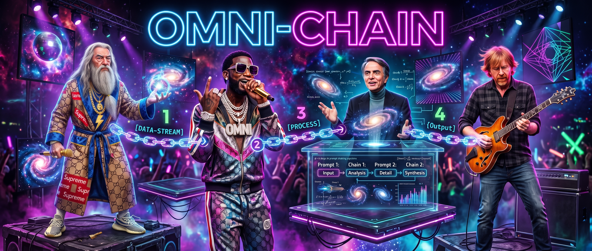

<div align="center">

[](imgs/omnichain_banner.png)

# 🎬 OmniChain 🪄

[](https://www.python.org/)
[](https://docs.astral.sh/uv/)
[](https://docs.astral.sh/ruff/)
[](https://github.com/astral-sh/ty)
[](https://adk.dev/)
[](https://docs.cloud.google.com/gemini-enterprise-agent-platform)
[](https://ai.google.dev/gemini-api/docs/omni)
[](https://fastapi.tiangolo.com/)
[](https://docs.pytest.org/)

**AI Parody & Mashup Video Studio** — inspired by viral sensations like **Dripwarts** (Snape Dogg, DumbleDior). OmniChain blends multiple IPs and subcultures into cohesive 30–60s parody videos, powered by `gemini-omni-flash-preview` for unified multimodal video with native synced audio and conversational edits.

</div>

OmniChain hides Omni Flash's **10-second generation limit** behind a director-style workflow. You give it one high-level vision; a **Storyboard Agent** slices it into 3–6 sub-10s shots, a **Prompt Compiler** rewrites each shot into a rigid *"Anchor & Inject"* prompt (defeating character decay when mixing IPs), Omni Flash generates each clip through the **Interactions API**, you refine any clip via conversational diffing (`previous_interaction_id`, one change per turn), and FFmpeg stitches the approved clips — laying your master audio track over the final cut.

## Pipeline

1. **The Vision** — concept + Style/Tone, optional master audio, reference images, and a target GCS bucket/folder.
2. **The Storyboard** — the agent slices the vision into editable ≤10s shot cards.
3. **The Dailies** — clips generate side-by-side; refine any one with a chat (one change per turn).
4. **The Final Cut** — FFmpeg concatenates approved clips and muxes the master track.

## Tech stack

Python 3.12 · `uv` · `ruff` · `ty` · `pytest` · FastAPI · React (Vite + TS) · Google ADK · `google-genai` (Interactions API) · GCS · Firestore · FFmpeg · Cloud Run.

## Development

See [CODE_STANDARDS.md](CODE_STANDARDS.md). Backend uses `uv` for everything:

```bash
cd backend
uv sync --all-groups
uv run pytest
uv run ruff check . && uv run ty check src/
uv run uvicorn omnichain.main:app --reload
```

### Frontend (local)

```bash
cd frontend
npm install
npm run dev     # Vite dev server proxies /api → http://localhost:8000
```

## Provision GCP resources

Bootstrap the bucket, Firestore database, and APIs straight from your `.env`
(idempotent — safe to re-run):

```bash
./scripts/setup_gcp.sh --dry-run     # preview the gcloud commands
./scripts/setup_gcp.sh               # create bucket + Firestore + enable APIs
./scripts/setup_gcp.sh --with-sa     # also create the runtime SA + grant roles
```

The script reads `PROJECT_ID`, `GCP_REGION`, and `GCS_BUCKET_NAME` (expanding
`${PROJECT_ID}`) from `.env`. Requires an authenticated `gcloud`.

## Deployment (Cloud Run)

A single multi-stage [`Dockerfile`](Dockerfile) builds the React SPA, then serves
it from the FastAPI backend (with `ffmpeg` installed for assembly). The image
listens on `$PORT` (Cloud Run injects `8080`).

```bash
# 1. Build + push (Artifact Registry)
gcloud builds submit --tag REGION-docker.pkg.dev/PROJECT_ID/omnichain/omnichain:latest

# 2. Deploy
gcloud run deploy omnichain \
  --image REGION-docker.pkg.dev/PROJECT_ID/omnichain/omnichain:latest \
  --region REGION \
  --service-account omnichain-sa@PROJECT_ID.iam.gserviceaccount.com \
  --set-env-vars GOOGLE_GENAI_USE_VERTEXAI=true,GOOGLE_CLOUD_PROJECT=PROJECT_ID,GOOGLE_CLOUD_LOCATION=global,GCS_BUCKET_NAME=YOUR_BUCKET \
  --no-allow-unauthenticated      # guard with IAM/IAP; add end-user auth before opening up
```

### Required env vars

| Variable | Purpose |
| --- | --- |
| `GOOGLE_GENAI_USE_VERTEXAI` | `true` to auth via Vertex AI (ADC); else set `GOOGLE_API_KEY` |
| `GOOGLE_CLOUD_PROJECT` / `GOOGLE_CLOUD_LOCATION` | Vertex project + location |
| `GCS_BUCKET_NAME` | Default assets bucket |
| `STORYBOARD_MODEL` / `OMNI_MODEL` | Override agent + video models (optional) |

### Service-account roles

The runtime service account needs:

- **Storage Object Admin** (`roles/storage.objectAdmin`) — read/write clips, refs, final cut.
- **Cloud Datastore User** (`roles/datastore.user`) — Firestore session/character metadata.
- **Vertex AI User** (`roles/aiplatform.user`) — Gemini + Omni Flash generation.

> Signed URLs require a service account that can sign (the default Cloud Run SA can
> via the IAM Credentials API — grant `roles/iam.serviceAccountTokenCreator` on itself).

> **Note:** OmniChain never falls back to Veo. All generation errors surface directly in the UI.
